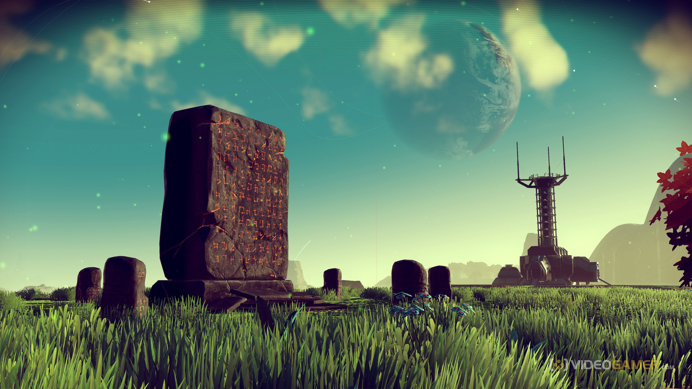

As my college experience draws to a close, I'm left confronting the future - *my* future - and reflecting on the knowledge I've sought so far, what I hope to obtain in this final year, and what I hope to achieve with it. 

## Interests
These past years, I've thrown myself into classes that focused on software, and gave it my all in classes that intertwined the software and hardware aspects of computing together. While the interplay of hardware and software intrigues me, and I understand the necessity of that relationship, ultimately my heart lies with software, algorithms, languages, and the virtual world. 

Software engineering appeals to me in a unique way by looking past the systems as the exist in a concrete way, and examines the principles and purposes behind them, and their tangible affects on people *as people*. I hope to learn how to tap into this type of analysis in assessing my own work. In doing so, I hope to also achieve an understanding of how to apply those actively in creating my own work.

## Goals
I've always taken interest in sprawling, complicated systems, with many interconnected bits that work in harmony to create a cohesive whole. But I realized that such an interest, on its own, doesn't truly inform myself or others on the work I hope to achieve. Based on this information and a self-assessment of what I love, I've come to the conclusion that *I desire to make systems that live and breathe.*

## Living Systems

Bridging the gap between complex systems and interactive art lies a medium that I believe remains untapped, and that's where my passion lies. I adore systems that attempt to capture the nuances of existence, whether the fleeting and lonely existence portrayed in the game No Man's Sky, or the self-sustaining and simulated web of mechanisms in Dwarf Fortress. I hope to develop some of the skills that would be necessary to pull from my own ideas, and one day impart unto this world a work whose systems feel truly alive.
