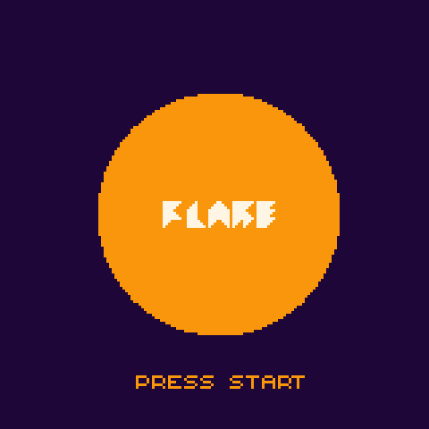
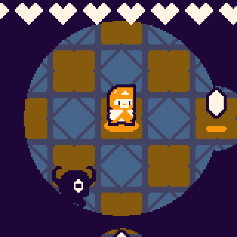

> In the ancient solar wars, mages harnessed the power of the sun to perform great feats of magic. In doing so, they used up vital energy needed to sustain it. Shadowy demons have since roamed the night, forcing humanity into hiding. The sun is on the brink of burning out, and lone solar knight remains to delve into the crystal dungeon in search of a solution. Will you retrieve the necessary catalyst to relight the sun, or will you fall to the shadows like your comrades before you?

Flare is a game prototype created in 72 hours for Ludum Dare 39. It was created using the LOVE game engine and the Lua scripting language, as well as a custom framework that was in development for a few weeks prior to Ludum Dare 39. This was my first time using the LOVE game engine, and is still in development.