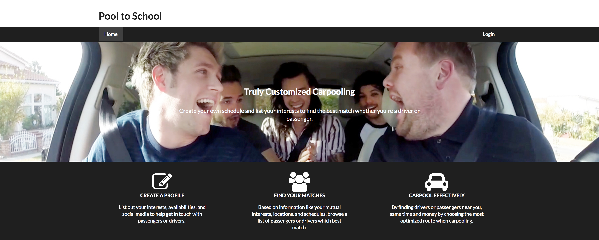
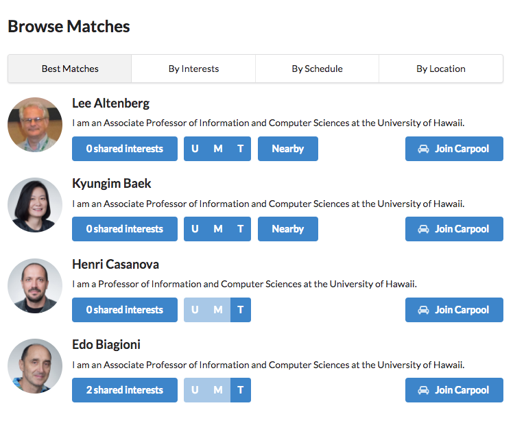

## Overview

> Pool to School allows for students to find other students that live near each other to carpool to school. Manoa students can login and create a profile to see other students that live within a specified radius and pool to school will match students according to schedule and places they will be at or need to be at or other criteria they specify like interest or classes.

## Responsibilities

My responsibilities in this project started primarily in the front-end: I designed the look of the website in Semantic UI, checking in with my members and verifying intended features with them. I also prototyped the mockups' functionality using client-side JavaScript and jQuery. 

As things went on, I realized that the backend schemas would need to be constructed to result in the outward functionality we desired, and that I would need to carefully rewrite the code from the mockup pages to work in Meteor. Therefore, I accepted those responsibilities as well.

## Knowledge Gained

Through this experience, I gained a more detailed understanding of working with Semantic UI and other front-end frameworks, and interconnecting them with JavaScript and jQuery. I also learned more detailed knowledge about JavaScript and working with JavaScript objects, as produced by Meteor and MongoDB. In order to rework the schema of Pool to School, I learned more about SimpleSchema, and had to learn different ways to model the data in a NoSQL database system like MongoDB. Finally, in working with Meteor and in attempting to get server-side sorting working that was instantly available to the client, I learned more about reactive variables and how to better take advantage of them.

## Screenshots

## Additional Resources

- [Pool to School's live Meteor deployment](https://pooltoschool.meteorapp.com/)
- [Pool to School's github.io project page](https://pool-tp-school.github.io/)
- [Pool to School's Github Organization](https://github.com/pool-to-school/)