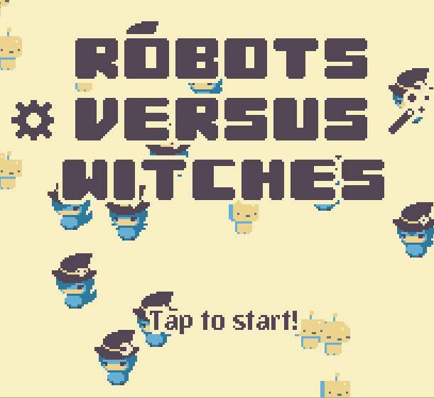
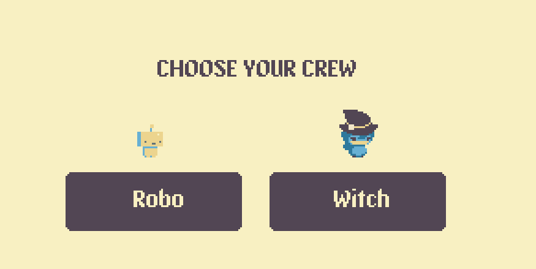
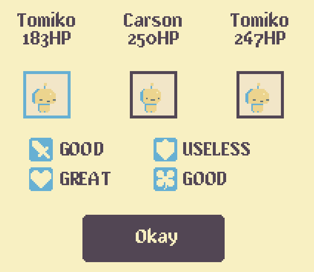
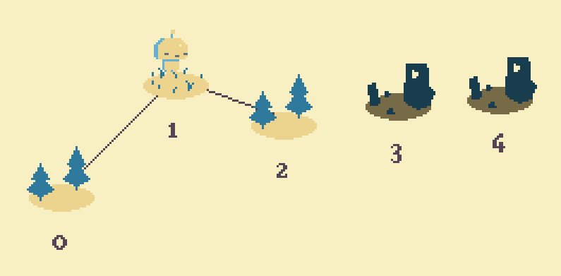
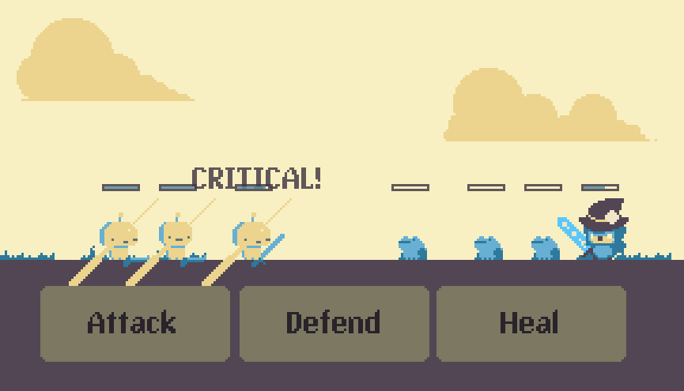
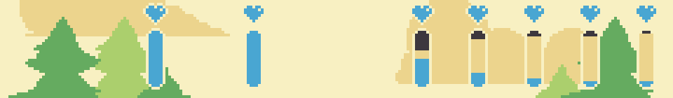
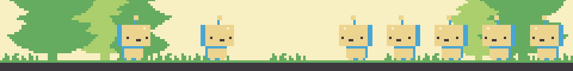
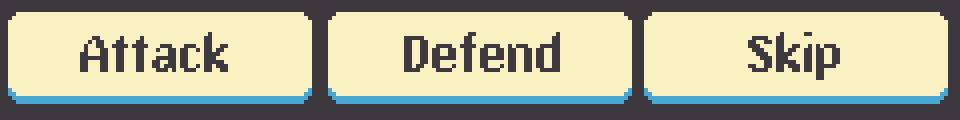

Robots Vs. Witches is a small game that was prototyped in 24 hours for the AT&T/UH Mobile App Hackathon in February 2015. Developed by a team of three, you command a group of either witches or robots in a conquest for territory, wielding weapons, magic, and machinery to accomplish your goals. I was the programmer for our team, working together with an artist remotely and a musician locally.

The prototype allows you to pick a class, sets you up with a random party of characters, and then gets you on your way. It's a traversal across a linear map, fighting groups of enemies in the opposing class. The AT&T M2X API is used to track individual progress and can offer insight on player activity, such as which areas cause the most trouble for players, and may cause them to stop playing, and was awarded **Best Use of M2X APIs**.

Robots vs Witches is still being developed, with a new version expanding the ideas of the prototype in the works.

